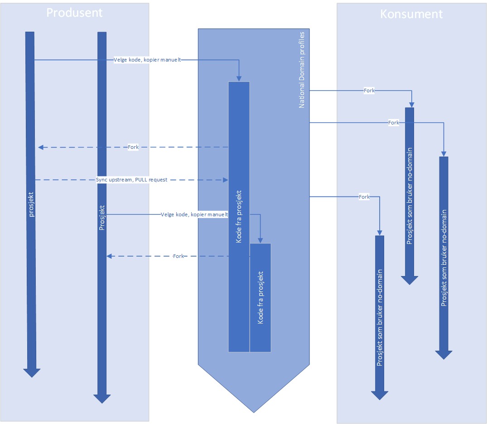

# no-domain
National domain profiles for the Norwegian realm (Nasjonale områdeprofiler) - FHIR R4

## Foreslåtte prinsipper for områdeprofiler (kladd, under arbeid!)

1. Anvendelsen for områdeprofilen er tydelig definert
2. Områdeprofiler er basert på basisprofiler
3. Områdeprofiler er utarbeidet basert på utviklingsprosess for områdeprofiler
4. Områdeprofiler er uavhengig av samhandlingsmodell
5. Områdeprofiler navngis alltid med prefix no-domain
6. Områdeprofiler er basert på relevante internasjonale spesifikasjoner
7. Bruk av «must-support» i områdeprofiler
8. Områdeprofiler kan beskrive valgfrie elementer/ ekstensjoner
9. Dybde vs grunnhet i områdeprofiler (under arbeid)
10. Områdeprofiler skal publiseres som en implementasjonsguide

## Plan

### September 2020

- Ferdigstille utkast prinsipper for områdeprofiler
- Ferdigstille utkast metode/prosess for utvikling av områdeprofiler
- Lage oversikt over relevante internasjonale implementasjonsguider som grunnlag for nasjonale områdeprofiler (implementasjonsguider)

### Utvikle områdeprofiler, ingen dato

- Utvikle VitalSigns områdeprofiler basert på [hnfresk/hnvitalsigns profiler](https://github.com/hn-fresk/hnvitalsigns/tree/master)
- Legemidler, "enkel" -- eksempelvis for PLL, eResept, Kjernejournal/IPS etc. 
- Legemidler, "avansert" -- eksempelvis for avansert dosering, EPJ/kurvesystem-integrasjon

## Workflow

Forslag til workflow.

