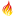

# Licence Legal - v0.9.74

* [**Table of Contents**](toc.md)
* **Licence Legal**

## Licence Legal

### License and Legal Terms

This document is licensed under Creative Commons "No Rights Reserved" ([CC0](https://creativecommons.org/publicdomain/zero/1.0/)).

HL7®, HEALTH LEVEL SEVEN®, FHIR® and the FHIR ® are trademarks owned by Health Level Seven International, registered with the United States Patent and Trademark Office.

This implementation guide contains and references intellectual property owned by third parties ("Third Party IP"). Acceptance of these License Terms does not grant any rights with respect to Third Party IP. The licensee alone is responsible for identifying and obtaining any necessary licenses or authorizations to utilize Third Party IP in connection with the specification or otherwise.

See also [http://hl7.org/fhir/license.html](http://hl7.org/fhir/license.html)

Following is a non-exhaustive list of third-party artifacts and terminologies that may require a separate license:

**SNOMED Clinical Terms® (SNOMED CT®)** This material includes SNOMED Clinical Terms® (SNOMED CT®) which is used by permission of SNOMED International (former known as International Health Terminology Standards Development Organisation IHTSDO). All rights reserved. SNOMED CT®, was originally created by The College of American Pathologists. “SNOMED” and “SNOMED CT” are registered trademarks of SNOMED International.

**Logical Observation Identifiers Names and Codes LOINC** This material contains content from LOINC® (http://loinc.org). The LOINC table, LOINC codes, and LOINC panels and forms file are copyright © 1995-2013, Regenstrief Institute, Inc. and the Logical Observation Identifiers Names and Codes (LOINC) Committee and available at no cost under the license at http://loinc.org/terms-of-use.

