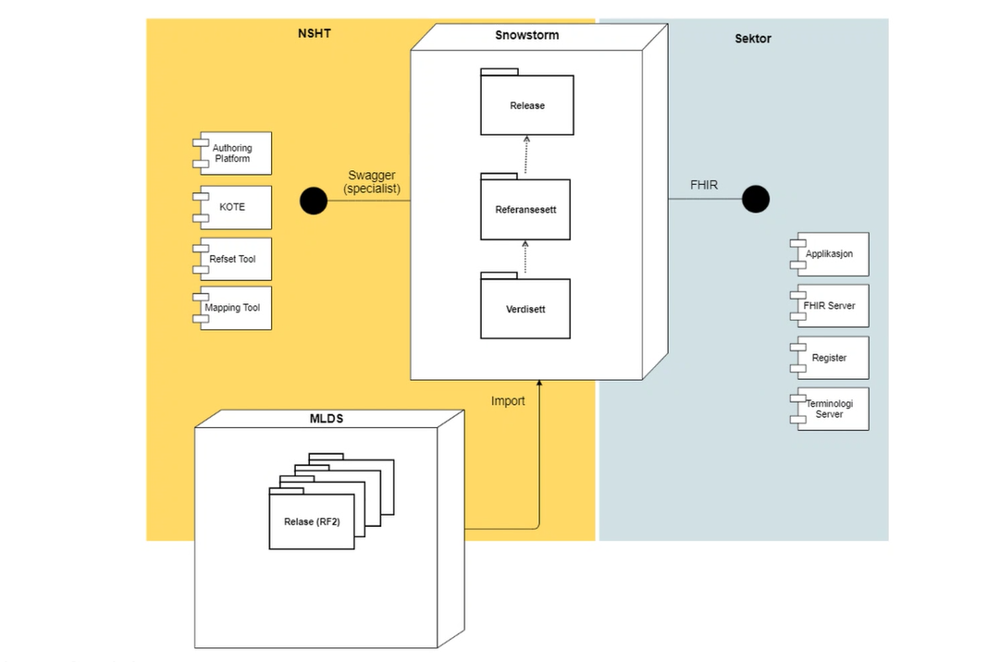

# 2023-09-14 Arbeidsmøte

## Tema: Refset for vitale parametere, prinsipielle spørsmål

## Tilstede

Øyvind, Terje, Thomas, Karol, Lars Andreas, Mark, Ulrich, Eirik og Marte

## Agenda

Foreløpig agenda

1. Forslag til løsning i forhold til de 15? verdisettene som trengs i forbindelse vitale parametere (Karol)
1. konkrete spørsmål knyttet til opprettelsen av verdisettene.
1. Hva gjør vi i forhold til NRUA miljøet?
1. Fortsette diskusjon av prinsippielle spørsmål
1. Oppsummering/konklusjoner
1. Eventuelt

## Prinsipielle spørsmål til diskusjon

* Granularitet av refset - hvordan bør disse struktureres og hvordan brukes de i forbindelse med FHIR implementasjoner
* Dokumentasjon - av terminologibinding i IG - som en del av vitale parametere eller som egen IG for terminologi?
* Hvordan avklarer vi faglige spørsmål ved mapping mellom ulike modeller?
* Metode for områdeprofiler - mangler prinsipper og beskrivelse av terminologibinding forslag til oppdatering av metoden.

## Notater

### Løsning for de 15 verdisettene

* SNOSTORM server skal gjøre terminologi tilgjengelig.
  * Kan også inneholde verdisett og refset.
* Referansesettene er egentlig ikke kjernevirksomhet for direktoratet.
* Hvem har da ansvar for utvikling og forvaltning av verdisett?
* KOTE komponent for å håndtere sektorbehov for endring/oppdatering (portal)
  * Mapping, nye begreper og oversettelse.
* Terminologservere i sektor kan integrere mot Snowstorm via FHIR grensesnitt (sammen med andre eksterne komponenter).
* Per tid er det ett referansesett som er delt opp i flere valueset.
  * Verdisettene blir gitt hver sin unike identifikator
  * Kan hente verdisettene - basert på id og url
    * url'en kan hete hva som helst
    * Hvordan skal url'ene til verdisettene håndteres ved endring av versjoner
      * Av SNOMED CT?
      * Av FHIR verdisett?
      * Hvordan skal verdisettene forvaltes.
  * Dynamiske verdisett basert på ECL søk støttes av serveren.
  * Versjonshåndtering må vi diskutere videre.
    * Kravlisten for å lage FHIR implementasjoner og FHIR IG
  * Forvaltningen og hvordan skal det henge sammen, viste forsøk på integrasjon i IG i møtet.
  * Hvordan får vi brukt de eksterne URL'ene mot SNOMED server

### Konkrete spørsmål fra LAN

* Mismatch i display value for kodene Puls målemetode.
  * Ikke oppdatert, men det kommer
* Missing SNOMED koder for display values for puls::målemetode og blodtrykk::målemetode
  * Ikke oppdatert, men det kommer

### NRUA

Hvordan får vi med oss Arketypemiljøet?
**Doodle for å finne et tidspunkt for neste møte?**
Fysisk møte?

* Det er nå det skjer så vi må ha dem med nå.
* NRUA har ønske om å delta, men det er vanskelig med tidspunkt.
* Vi trenger fast representasjon i utvikling av og ferdigstillelse av verdisettene.
* Må også diskutere server/forvaltningsspørsmål med arketypemiljøet.

### Dokumentasjon av terminologi og IG

* Fra HL7 Norge sammenheng tenker vi FHIR IG med knytning til terminologi er målbildet.
* Arketypemapping blir jo ikke dokumentert i FHIR IG.
* SPUN - vurdere SPUN på sikt kanskje?
* På kort sikt er det FHIR IG vi jobber med.

### Avklaring av faglige spørsmål

**Hvordan avklarer vi faglige spørsmål ved mapping mellom ulike modeller?**

* Mapping mellom informasjonsmodeller, bruk av terminologi og informasjonsmodell
* Noen må snakke sammen.
* Bruk av verdisettene krever samarbeid, bør gå fortere.
* Viktig å dokumentere prosessen som er gjennomført i dette prosjektet med vitale parametere så vi kan lære og forbedre oss.

### Aksjoner

1. Thomas: Doodle for neste møte, om ca 3 uker. Vedbjørn, Silje og Bjørn Tore.
2. Thomas, LAN og Øyvind: FHIR miljøet må si noe om sine krav til verdisett og hvordan de ønsker å benytte disse inn i sin produksjon av IG og implementasjoner.
3. Diskusjon til neste gang: Avklaring av detaljerte spørsmål knyttet til navngivning og identifikasjon av verdisett, versjonshåndtering av verdisett og refset's.
4. Diskusjon til neste gang: Avklaring av detaljerte spørsmål knyttet til verdisettene og innholdet i disse.
5. Karol Avklaring av detaljerte spørsmål til verdisettene fra LAN
6. Thomas og Øyvind: Utkast til metode for utvikling av terminologi knyttet til no-domain.
