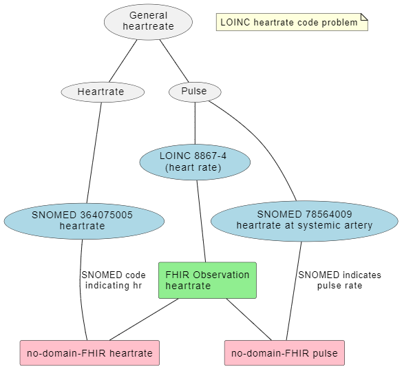

# 2024-10-31 - Vitale parametere QA møte

1. Innledning - Thomas
   1. Oppsummering fra sist, problembeskrivelse  
   2. Oppsummering fra WGM, endringer i vitale-paramtere
   3. Jira sak om extensions [Jira FHIR-48387](https://jira.hl7.org/browse/FHIR-48387)
   4. Gjennomgang av extensions, vurdere hva som bør være component.
2. Puls vs HR
3. Eventuelt/diskusjon

## Tilstede

Marte Rime Bø  
Thomas T Rosenlund  
Vebjørn Arntzen
Øyvind AAssve
Lars Andreas Nystad
Terje Bless

## Problembeskrivelse forslag

Oppklarende eller helt feil?

## Notater

1. Ta inspirasjon fra endringene i FHIR R6 - endre til å bruke categori?
   1. Bruke de kodene vi angir.
   2. Profilere direkte på observations.
   3. Vil få problemer med de som bruker vital signs direkte.
   4. Resten av verden vil ikke forstå "Norske" vitale parametere.
      1. Er det et stort interoperabilitetsproblem?
   5. KONKLUSJON: vi holder på R4 profilene og gir guideance på bruk av magic values vs mer spesifikke koder.
      1. R6 alignment gir ikke verdi.
      2. Kan eventuelt legge inn kategorikode allerede nå (i tillegg til Vital signs koden).
   6. KONKLUSJON: Puls vs HR - kan isoleres som problem.
      1. Spille opp som sak i HL7 og OpenEHR samarbeidet, Vebjørn Arntzen - kan få en rolle opp i dette. Snakke med Grahame om denne saken.
      2. AKSJON: Vebjørn, Silje og Terje prøver å diskutere dette med OpenEHR miljøet.
2. Components istedenfor extensions?
   1. AKSJON: Thomas bumper Jira saken - for å få inntrykk
      1. Thomas ser litt nøyere på v6 profilene om de gir noen føringer.
      2. Avtale møte med OO.
3. Ferdigstile IG for høring
   1. Thomas: Redigere litt på dokumentasjonen, spesielt puls og HR guideance
   2. Thomas: Sende oppgaver til LAN - oppdateringer fra forrige gang.
   3. Thomas: Sende lenke til md-filer som kan redigeres av hele gruppa.
4. Neste møte
   1. 14 november klokken 1000
