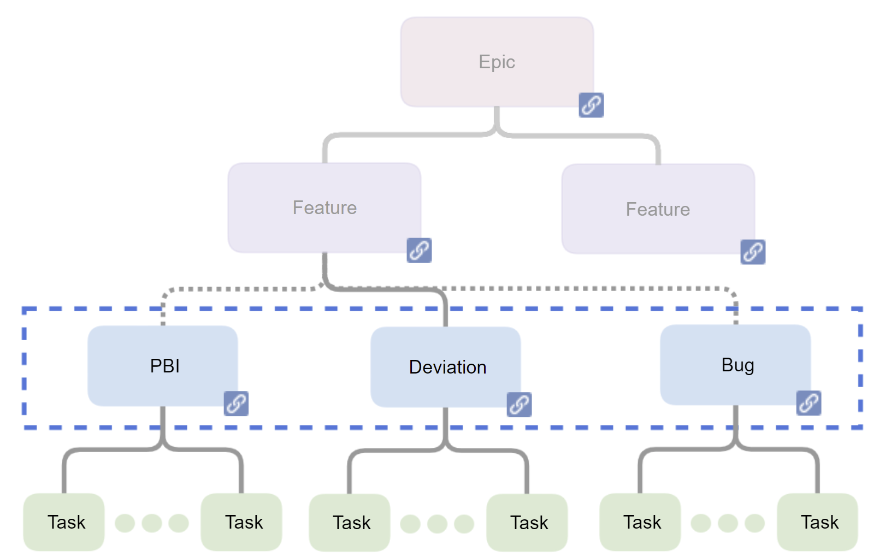

# Smidig utvikling og prosjektstyring av områdeprofiler

I forbindelse med smidig utvikling er det vanlig å bryte oppgavene ned i Epics, Features og Story(PBI) for å sortere oppgaver til behov og krav og organisere disse i tid i forhold til leveranser og sprinter. Vi går i denne teksten gjennom hvordan en slik metode kan benyttes i forbindelse med smidig utvikling av nasjonale områdeprofiler for HL7 FHIR.

## Overordnet struktur Epics og Features

Issues merkes med tag's for å skille Epics fra features og PBI/Story, etterhvert vil det nok også benyttes Bug's og kanskje Deviations. Store oppgaver kan videre brytes ned i Tasks, hvis det er behov.

### Epic (epos)

Et større målbart resultat eller en komponent som prosjektet skal levere. En Epic bør være koblet til et eller flere Funksjonelle/ikke-funksjonaelle krav og utgjøre en del av løsningen eller besvarelsen på dette.

I forbindelse med utvikling av områdeprofiler kan dette være en fase i utviklingsmodellen for områdeprofiler, metoden forteller da om hva som er de overordnede kravene til leveransen for eksempel på beskrivelse av behov og krav eller utviklingen av selve områdeprofilen. Epos vil som regel leve gjennom mange sprinter og flere releaser, og kan leve evig. Epic kan også være større funksjonelle områder av selve løsningen eller profileringen. Epos skal beskrive hvilke behov og krav som må løses for at eposet kan beskrives som levert.

### Feature

Nedbrytning av en Epic til mindre funksjonelle deler. En Feature skal alltid leveres innenfor en release, men kan leve gjennom mange sprinter. I forbindelsen med utarbeidelsen av en områdeprofil kan dette være en versjon av en utredning, en versjon av kravspesifikasjonen, en versjon av områdeprofil Implementasjonsguide eller en FHIR ConformanceRessurs. Det er på dette nivået man begynner å forholde seg til versjoner, så Features bør tagges både i forhold til release eller versjonsnummer og knyttes til en milepæl.

### Story (PBI)

Nedbrytning av en Feature til funksjonelle oppgaver som kan fullføres iløpet av en sprint (testes og leveres). Skal vanligvis leve i en sprint med mindre en Story gjenåpnes senere. I forbindelse med utarbeidelsen av en områdeprofil kan dette være et kapittel av en Implementasjonsguide, eller dokumentasjonen og definisjonen av en spesifikk FHIR ConformanceRessurs. Knyttes vanligvis til en feature men kan tagges med versjonsnummer og release hvis det gjør det enklere å sortere oppgaver.
